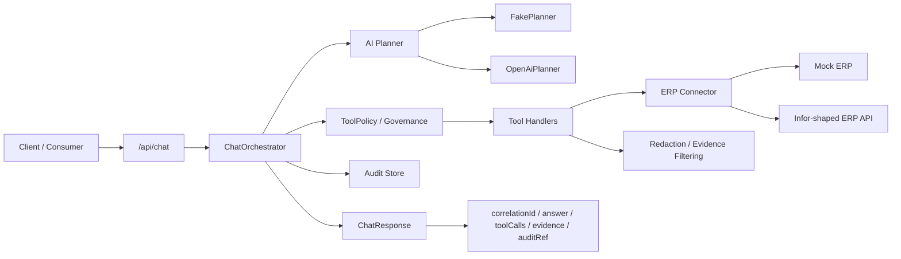
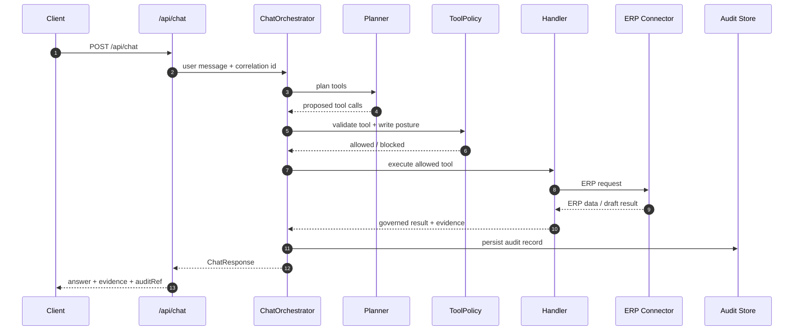
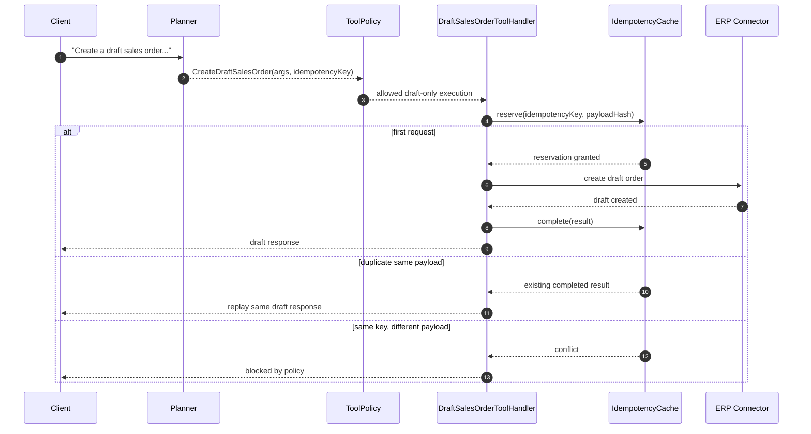

<div align="center">

# EclipseErpOpenAiKit.NET

**Production-shaped ERP ↔ OpenAI integration kit for .NET 10**

*Natural-language ERP workflows with governed tool execution, draft-only safety guardrails, deterministic offline demos, and optional real OpenAI tool-calling.*

<p>
  
  
  
  
  
  
  
  
</p>

</div>

---

## Why this repo exists

Most **ERP + AI** demos stop at prompt engineering.

This one does not.

`EclipseErpOpenAiKit.NET` is a **reference implementation** for teams that want to explore AI-assisted ERP workflows **without skipping the hard parts**:

- stable backend contracts
- governed tool execution
- draft-only write posture
- idempotent replay-safe behavior
- evidence filtering and redaction
- correlation-driven traceability
- deterministic offline testing

It is designed to show how a chat-style interface can sit **in front of ERP operations** while keeping execution bounded, observable, and testable.

## What it demonstrates

### ERP integration, not just chat UI
The kit exposes a stable `/api/chat` entry point that orchestrates concrete ERP-facing scenarios instead of generating free-form responses with no system boundary.

### AI as planner, not unchecked operator
The planner proposes tool calls. Policy and handlers decide what is actually allowed to run. That separation keeps the AI layer useful **without letting it own execution**.

### Safer write behavior
Write-like behavior is intentionally constrained to **draft sales order creation**, protected by allowlisting and **mandatory idempotency keys**.

### Explainable responses
Responses include not only an answer, but also **tool call information, evidence, correlation, and audit reference**.

### Offline by default
The repo can run end-to-end with a deterministic planner and mock ERP, so demos and tests do not depend on live OpenAI behavior.

---

## The pitch

This repository is best understood as a **production-shaped integration kit** for:

- technical leaders evaluating backend/integration design quality
- teams exploring governed AI workflows over ERP systems
- buyers who want a realistic demo of how AI can assist ERP operations
- engineers who need a maintainable starting point, not a throwaway prototype

It is **not** a generic ERP SDK and **not** a “just add prompts” showcase.

It is a deliberately scoped example of how to combine:

- **ERP connector abstraction**
- **OpenAI tool/function calling**
- **governance controls**
- **draft-only write safety**
- **contract-first thinking**
- **testable orchestration**

---

## Implemented scenarios

| Scenario | What it does | Why it matters |
|---|---|---|
| **Inventory availability** | Turns a natural-language request into an ERP inventory lookup with structured evidence | Demonstrates a clean read-only ERP query path |
| **Draft sales order creation** | Creates a **draft** order only, with idempotent replay for repeated requests | Shows mature write safety and duplicate prevention |
| **Order exception explanation** | Retrieves ERP exception context, filters to allowlisted evidence, and optionally summarizes it | Demonstrates governance between ERP data and AI output |

---

## Why this is technically interesting

### 1) Stable API contract
Every `/api/chat` response returns a predictable shape:

- `correlationId`
- `answer`
- `toolCalls`
- `evidence`
- `auditRef`

That makes the gateway easier to consume, test, and evolve.

### 2) Clear planner/executor boundary
The AI layer does not directly “do things.”
It proposes tool calls.
Execution remains in the backend, behind:

- tool allowlisting
- argument validation
- governance controls
- handler-specific logic
- ERP connector boundaries

### 3) Draft-only write posture
The most dangerous category of workflow — writes — is intentionally constrained.
This repo demonstrates a pattern where AI can assist with business workflows **without immediately committing live ERP mutations**.

### 4) Idempotent replay-safe behavior
Draft order creation requires an `idempotencyKey`, stores payload hashes, and safely replays prior results for duplicate requests with the same payload.

### 5) Governance before output
Order-exception flows do not blindly return raw ERP payloads.
They apply:

- evidence allowlisting
- field redaction
- controlled summarization

### 6) Correlation and auditability
Incoming correlation IDs propagate through the gateway, orchestration layer, outbound ERP calls, and audit references — the kind of detail that matters in real support and operations work.

### 7) Deterministic demo path
A fake planner plus mock ERP keeps the default flow stable, reproducible, and test-friendly, while still supporting optional real OpenAI tool-calling.

---

## Architecture at a glance



---

## Request flow



---

## The differentiated flow: guarded draft creation



---

## Core qualities worth noticing

### Contract-first posture
The repository includes an OpenAPI contract artifact and contract tests, reinforcing the idea that the AI-facing gateway still depends on explicit backend contracts.

### Swappable ERP integration modes
The connector layer supports a default mock ERP path and an Infor-shaped integration path with OAuth2 client-credentials, bearer auth, and correlation header propagation.

### Optional real OpenAI mode
OpenAI can be enabled for tool/function calling and optional order-exception summarization, but the main demo path remains stable without it.

### Retry-aware AI integration
The OpenAI client wrapper includes retry behavior and optional payload diagnostics, which moves the integration beyond a single happy-path HTTP call.

### Modular backend split
The project is separated into focused areas such as:

- AI planning
- ERP connectors
- domain contracts
- governance
- observability
- gateway host
- mock ERP
- contract/integration/unit tests

That modularity makes the system easier to reason about and extend.

---

## Quickstart

### Prerequisites

- .NET 10 SDK
- Docker Desktop
- Azure Functions Core Tools (recommended for local workflow)

### Local flow

```powershell
.\dev.ps1 up
.\dev.ps1 run
.\dev.ps1 demo
.\dev.ps1 test
```

### Optional OpenAI mode

```powershell
$env:OPENAI_API_KEY = "your-key"
$env:OPENAI_MODE = "emulated"     # emulated | real | off
$env:OPENAI_SUMMARIZE = "1"       # optional order-exception summary
$env:OPENAI_LOG_PAYLOADS = "1"    # temporary diagnostics
$env:OPENAI_RETRY_BASE_DELAY_SEC = "1"
$env:OPENAI_RETRY_MAX_DELAY_SEC = "60"
```

> [!IMPORTANT]
> The default experience is intentionally **offline-friendly and deterministic**. Real OpenAI mode is optional.

---

## Example use cases

### Inventory question
> “Do we have item ABC-123 in stock?”

Expected behavior:
- planner selects inventory lookup
- ERP inventory endpoint is called
- response returns answer plus structured evidence

### Draft order request
> “Create a draft sales order for customer X with item Y for next Tuesday.”

Expected behavior:
- planner selects draft order tool
- policy requires idempotency
- ERP draft endpoint executes once
- repeated request with the same payload replays the same result

### Order exception question
> “Why is order 12345 blocked?”

Expected behavior:
- planner selects exception explanation
- ERP returns exception context
- only allowlisted evidence fields are surfaced
- optional summarizer produces a concise explanation

---

## Proof, not promises

This repo already includes:

- **unit tests**
- **integration tests**
- **contract tests**
- **mock ERP service**
- **example requests**
- **contract artifacts**
- **supplemental design docs**
- **deterministic local demo scripts**

That matters because the strongest part of this project is not the tagline.
It is the combination of **behavioral proof + explicit boundaries + realistic safeguards**.

---

## Repository shape

```text
apps/
  Gateway.Functions/         HTTP gateway host

src/
  EclipseAi.AI/             planners, OpenAI integration, summarizers
  EclipseAi.Connectors.Erp/ ERP connector abstractions and implementations
  EclipseAi.Domain/         response and domain models
  EclipseAi.Governance/     tool policy, redaction, safety controls
  EclipseAi.Observability/  correlation utilities

mocks/
  Mock.Erp/                 local ERP simulation

contracts/
  eclipse.sample.openapi.json

tests/
  Unit/
  Integration/
  Contract/

examples/
  requests.http
```

---

## Extension points

This project is especially useful if you want to explore how to extend a governed ERP+AI gateway.

Natural next steps include:

- adding new `IChatToolHandler` scenarios
- expanding the contract-first adapter path
- enriching exception handling and next-action recommendations
- replacing file-based local persistence with a more durable store
- exporting architecture diagrams and CI badges
- evolving the current host strategy further

---

## Non-goals / current boundaries

To keep the scope honest, this repo currently focuses on a narrow, high-signal slice of the problem.

It does **not** currently demonstrate:

- generic ERP coverage
- committed live-write workflows beyond draft posture
- event-driven ingestion or sync pipelines
- vector search / RAG
- long-running memory or stateful chat history
- database-backed persistence
- packaged SDK / NuGet distribution

That is part of the point: the repo goes deeper on **governed execution quality** instead of pretending to solve everything.

---

## Documentation

Useful repo materials include:

- `DEMO.md`
- `examples/requests.http`
- `contracts/eclipse.sample.openapi.json`
- `docs/adding-a-new-erp.md`
- `docs/decisions.md`
- `docs/threat-model.md`
- `docs/real-openai-usage-flow.md`
- `docs/scenarios.md`

---

## Positioning statement

> **EclipseErpOpenAiKit.NET is a production-shaped .NET reference implementation for governed ERP ↔ OpenAI workflows — combining contract-first integration, draft-only safety, idempotent execution, explainable evidence, and deterministic local demos.**

---

## License

MIT
