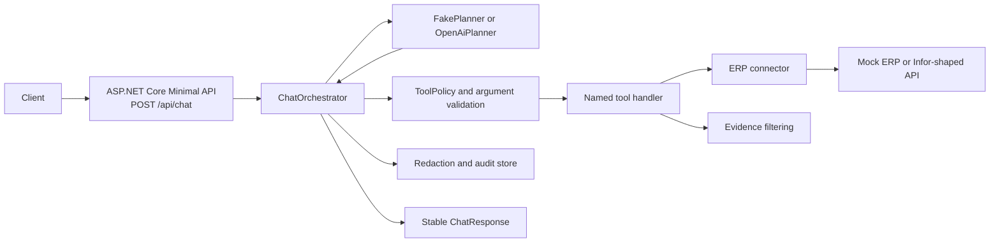

<div align="center">

# EclipseErpOpenAiKit.NET

**A production-minded reference implementation for governed ERP tool orchestration on .NET 10**

*The model proposes. .NET governs. The ERP executes. The audit proves.*

<p>
  
  
  
  
</p>

</div>

## What this repository is

`EclipseErpOpenAiKit.NET` demonstrates a small, governed path from a natural-language ERP request to a bounded backend operation. A planner proposes named tool calls; .NET policy and handlers validate them; an ERP connector performs an allowed operation; and the response carries evidence, correlation, and an audit reference.

The current host is an **ASP.NET Core Minimal API** targeting .NET 10. The project remains under the legacy directory name `apps/Gateway.Functions`, but its project SDK and startup model are ASP.NET Core (`Microsoft.NET.Sdk.Web` and `WebApplication`), not Azure Functions. See [the gateway project](apps/Gateway.Functions/Gateway.Functions.csproj) and [its startup code](apps/Gateway.Functions/Program.cs).

The default path is deterministic and offline: it uses `FakePlanner` and a local mock ERP, so tests and the core demo do not require an OpenAI key.

## Evidence at a glance

| Claim | Implementation | Automated proof |
|---|---|---|
| `/api/chat` returns `correlationId`, `answer`, `toolCalls`, `evidence`, and `auditRef` | [domain records](src/EclipseAi.Domain/Models.cs), [endpoint and orchestration](apps/Gateway.Functions/Program.cs) | [scenario integration tests](tests/Integration/EclipseAi.Tests.Integration/ChatScenariosTests.cs) |
| Unknown tools and draft writes without idempotency are blocked | [tool policy](src/EclipseAi.Governance/Governance.cs), [tool handlers](apps/Gateway.Functions/Services/ChatToolHandlers.cs) | [governance integration tests](tests/Integration/EclipseAi.Tests.Integration/ChatScenariosTests.cs) |
| Duplicate draft requests replay instead of creating a second draft | [idempotency cache](apps/Gateway.Functions/Services/AuditStore.cs) | [orchestrator and scenario tests](tests/Integration/EclipseAi.Tests.Integration/ChatOrchestratorTests.cs) |
| Correlation reaches ERP calls and audit output | [correlation scope](src/EclipseAi.Observability/Correlation.cs), [orchestrator](apps/Gateway.Functions/Services/ChatOrchestrator.cs) | [unit and integration tests](tests/Unit/EclipseAi.Tests.Unit/UnitTest1.cs) |
| Order-exception evidence is allowlisted and audit data is redacted | [exception handler](apps/Gateway.Functions/Services/ChatToolHandlers.cs), [redactor](src/EclipseAi.Governance/Governance.cs) | [governance integration tests](tests/Integration/EclipseAi.Tests.Integration/ChatScenariosTests.cs) |
| Infor-shaped HTTP calls use OAuth2 bearer tokens and safe errors | [ERP connector](src/EclipseAi.Connectors.Erp/ErpConnector.cs) | [connector unit tests](tests/Unit/EclipseAi.Tests.Unit/UnitTest1.cs), [Infor integration tests](tests/Integration/EclipseAi.Tests.Integration/ChatScenariosTests.cs) |
| ERP endpoint shapes have a checked contract | [OpenAPI sample](contracts/eclipse.sample.openapi.json) | [contract tests](tests/Contract/EclipseAi.Tests.Contract/OpenApiContractTests.cs) |

## Implemented capabilities

### Three bounded ERP scenarios

| Scenario | Executed operation | Governed result |
|---|---|---|
| Inventory availability | Read item quantity and ETA for a warehouse | Structured inventory evidence |
| Draft sales order | Create a draft only, guarded by an idempotency key | Replay-safe draft result; no automatic commit |
| Order exception explanation | Read exception context and optionally summarize it | Allowlisted evidence with sensitive fields excluded |

### Planner/executor separation

The planner returns tool proposals. `ToolPolicy`, argument readers, and named handlers decide whether a proposal can execute. The model does not call the ERP directly. The allowlist currently contains only `GetInventoryAvailability`, `CreateDraftSalesOrder`, and `ExplainOrderException`.

### Deterministic offline path

Without a usable OpenAI configuration, `PlannerFactory` selects `FakePlanner`. Integration tests replace external boundaries with deterministic doubles and do not call OpenAI. See [planner selection](src/EclipseAi.AI/PlannerFactory.cs), [the fake planner](src/EclipseAi.AI/FakePlanner.cs), and [the integration suite](tests/Integration/EclipseAi.Tests.Integration/ChatScenariosTests.cs).

### Optional integrations

- `OPENAI_MODE=real` enables the current OpenAI Responses API tool-calling path.
- `OPENAI_SUMMARIZE=1` enables optional order-exception summarization when OpenAI is configured.
- `ERP_MODE=infor` selects the Infor-shaped OAuth2 and typed HTTP connector path.
- The default ERP path calls the local mock ERP over HTTP.

## Architecture


```mermaid
flowchart LR
    C[Client] --> API[ASP.NET Core Minimal API<br/>POST /api/chat]
    API --> O[ChatOrchestrator]
    O --> P[FakePlanner or OpenAiPlanner]
    P --> O
    O --> G[ToolPolicy and argument validation]
    G --> H[Named tool handler]
    H --> E[ERP connector]
    E --> M[Mock ERP or Infor-shaped API]
    H --> F[Evidence filtering]
    O --> R[Redaction and audit store]
    O --> OUT[Stable ChatResponse]
```

The request is one bounded planning pass followed by zero or more allowlisted handler executions. Results are assembled into the stable response contract and written to the local audit store after redaction.

## Quickstart

### Prerequisites

- Windows PowerShell or PowerShell 7
- .NET 10 SDK
- Docker Desktop for `dev.ps1 up`, which starts the local service dependencies

Azure Functions Core Tools are not required. An OpenAI key is not required for the default path.

### Local workflow

Start the local services, then run the ASP.NET Core gateway on the HTTP port used by the demo:

```powershell
.\dev.ps1 up
dotnet run --project apps/Gateway.Functions/Gateway.Functions.csproj --no-launch-profile -p:RestoreUseStaticGraphEvaluation=true
```

In another terminal, exercise all three scenarios or run the tests:

```powershell
.\dev.ps1 demo
.\dev.ps1 test
```

The existing `dev.ps1 run` command remains available, but it currently consumes the legacy launch profile, whose ports differ from the demo's `http://localhost:5000` target and whose HTTPS endpoint requires a development certificate. The direct launch command above is the verified HTTP path; ticket 05 will reconcile the scripted and container workflows. Individual requests are available in [examples/requests.http](examples/requests.http) and [DEMO.md](DEMO.md).

### Optional OpenAI mode

```powershell
$env:OPENAI_API_KEY = "your-key"
$env:OPENAI_MODE = "real"        # off | emulated | real
$env:OPENAI_SUMMARIZE = "1"      # optional
```

Payload diagnostics are opt-in through `OPENAI_LOG_PAYLOADS=1` and can expose request content; use them only for controlled local troubleshooting.

### Optional Infor-shaped path

```powershell
$env:INFOR_BASE_URL = "https://your-infor-endpoint"
$env:INFOR_CLIENT_ID = "your-client-id"
$env:INFOR_CLIENT_SECRET = "your-client-secret"
.\dev.ps1 demo-infor
```

The included Infor path proves token acquisition, caching, bearer headers, correlation, typed endpoint calls, and safe error handling. It is an adapter example, not a claim of generic ERP coverage.

## Partial capabilities and current limitations

- **Real OpenAI planning exists but is not yet hardened for unattended real-ERP writes.** Strict tool schemas, explicit response-retention settings, end-to-end cancellation, and asynchronous orchestration are modernization work tracked in [plan.md](plan.md).
- **Real-ERP draft approval is not implemented.** The current policy requires draft posture and idempotency, but it does not yet obtain trusted approval or bind customer identity to verified server state.
- **Persistence is local.** Audit and idempotency records are file-based examples, not durable distributed storage.
- **The Infor contract is intentionally narrow.** It covers only the three demonstrated operations and is not a general Eclipse or Infor SDK.
- **Local workflow proof is incomplete.** Automated tests and the direct HTTP health path are proven, but the legacy `dev.ps1 run` launch profile, repeatable CI, and a complete container smoke path are deferred modernization work.

## Non-goals

This repository does not currently provide:

- autonomous or multi-agent execution
- an MCP-native server or client
- committed live ERP writes
- long-running chat memory or durable sessions
- event-driven ingestion, synchronization, RAG, or vector search
- cloud infrastructure, deployment environments, or a secrets platform
- a packaged ERP SDK or NuGet distribution

These boundaries keep the example focused on governed execution rather than broad platform claims.

## Future proposals

The focused modernization order is recorded in [plan.md](plan.md):

1. publish this truthful baseline
2. harden real OpenAI request schemas, retention, async behavior, and cancellation
3. fail closed for real-ERP draft writes and require trusted approval
4. bind draft customer identity to verified request-scoped context
5. prove the complete offline workflow in CI and containers

A **bounded tool-result loop**—returning tool results to the model for another constrained planning step—remains an explicit deferred design decision. It is not implemented or implied by the current single-pass orchestrator.

## Repository map

```text
apps/Gateway.Functions/         ASP.NET Core Minimal API host (legacy directory name)
src/EclipseAi.AI/              deterministic and optional OpenAI planners
src/EclipseAi.Connectors.Erp/  mock HTTP and Infor-shaped ERP connectors
src/EclipseAi.Domain/          request, response, tool, and evidence records
src/EclipseAi.Governance/      tool policy and redaction
src/EclipseAi.Observability/   correlation utilities
mocks/Mock.Erp/                local ERP simulation
contracts/                     OpenAPI sample contract
tests/                         unit, integration, and contract proof
```

Additional design and safety context is in [docs/decisions.md](docs/decisions.md), [docs/threat-model.md](docs/threat-model.md), and [docs/adding-a-new-erp.md](docs/adding-a-new-erp.md).

## License

MIT
